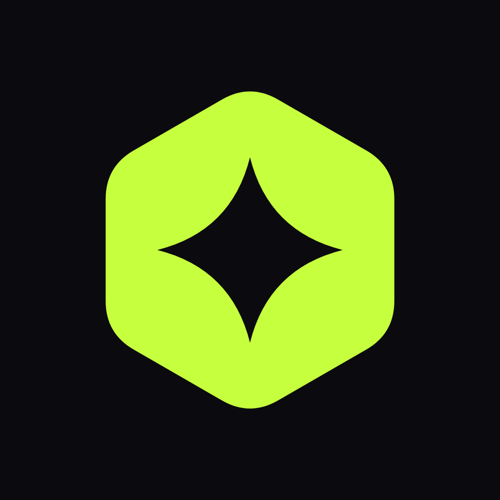

# Tool Theory: Faceless TikTok Playbook

A complete launch kit for a faceless TikTok account: the niche decision, the account, the videos, the voiceovers, the posting schedule and the money plan.



**Tool Theory** · `@tooltheory`<br>
_AI tools, tested. Tech, explained._<br>
Why this name, backup handles and bio: [02](02-account-setup.md)
<br clear="left">

> **The decision:** _"AI tools that save you time **and money**."_ This mixes the two top-scoring niches (AI tools/tech and personal finance). You get tech-level RPM, a money-saving audience that advertisers pay a premium for, recurring software affiliate income, and screen-recorded demos that are original by default. See [01](01-niche-research.md) for the ranking and sources.

## What's in here

| File | What it covers |
|---|---|
| [01 — Niche research](01-niche-research.md) | 11 niches scored on ROI, why AI tools + money wins, risks, sources |
| [02 — Account setup](02-account-setup.md) | Name, handles, bio, visual identity, setup checklist, 3-day warm-up |
| [03 — Content playbook](03-content-playbook.md) | 5 pillars, the 70-second video formula, 20 hooks, captions & hashtags, engagement system |
| [04 — Voiceover & production](04-voiceover-and-production.md) | Voice choice, ElevenLabs settings, TTS writing rules, editing template, per-video workflow, QA checklist |
| [05 — Posting schedule](05-posting-schedule.md) | Phases, time-slot test, **30-day calendar (40 videos)**, weekly rhythm, metrics, decision rules |
| [06 — Monetization](06-monetization.md) | Money roadmap by milestone, ROI model, startup costs, disclosure & safety rules |
| [scripts/week-01.md](scripts/week-01.md) | **Shortcuts #001–#007**: full voiceover, shot list, caption, pinned comment |
| [scripts/week-02.md](scripts/week-02.md) | **Shortcuts #008–#014** |
| [ideas-backlog.md](ideas-backlog.md) | 40 more ideas (#015–#054) with hooks, incl. seasonal ones |
| [brand/](brand/) | Logo (vector `logo.svg` + profile picture), logo options with a real-size test, 14 ready-made covers, cover template, safe-zone overlay, cover maker |
| [niche-scoring/](niche-scoring/) | Niche data + scoring script (change the weights, re-rank) |
| [tools/script_length.py](tools/script_length.py) | Checks every voiceover lands at 64–85s (over the 60s Creator Rewards minimum) |

## Day 1 quick start

1. **Create the account.** Follow the checklist in [02](02-account-setup.md). Keep it a **Personal** account, use [`brand/profile-picture.png`](brand/profile-picture.png), and start the 3-day warm-up.
2. **Pick your voice.** Decide once, per [04](04-voiceover-and-production.md). Cloning your own voice in ElevenLabs is the recommended option.
3. **Build the CapCut master template** ([04](04-voiceover-and-production.md#build-the-master-template-once-45-min-then-duplicate-it-for-every-video)).
4. **Produce #001–#007** from [scripts/week-01.md](scripts/week-01.md) on Days 2–3. The covers are already in [`brand/covers/`](brand/covers/).
5. **Day 4: first post.** From then on, follow the [30-day calendar](05-posting-schedule.md#30-day-calendar).

## Commands

```bash
# Re-rank niches after editing niche-scoring/niches.csv or the weights in score.py
python3 faceless-tiktok/niche-scoring/score.py

# Check every script's voiceover length (exits non-zero if any are out of range)
python3 faceless-tiktok/tools/script_length.py
```

## Honest expectations

- Month 1 revenue ≈ $0. The goal for the first 30 days is **40 published videos** and learning what works, not money.
- Creator Rewards needs 10K followers + 100K views in the last 30 days. Most of the money comes from affiliates, your own product and sponsors ([06](06-monetization.md)).
- Payout figures are creator-reported benchmarks as of Sept 2026. TikTok publishes no official RPM, and rates move month to month.
- AI tools change fast. Record every demo for real, and if the screen disagrees with the script, change the script.
